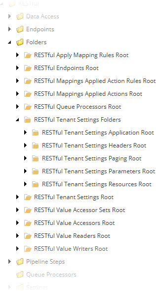

Add Tenant Settings Folders
=======================================

1. In Sitecore, open Template Manager.
2. Navigate to **Templates > Data Exchange > Providers > RESTful > Folders**.
3. Add a template folder named **RESTful Tenant Settings Folders**.
4. Navigate to **Templates > Data Exchange > Providers > RESTful > Folders > RESTful Tenant Settings Folders**.
5. Add the following template:

   +-------------------+--------------------------------------------------------------------------------------------------+
   | Name              | **RESTful Tenant Application Settings Root**                                                     |
   +-------------------+--------------------------------------------------------------------------------------------------+
   | Base template     | **Templates > System > Templates > Standard template**                                           |
   +-------------------+--------------------------------------------------------------------------------------------------+
   | Location          | **Templates > Data Exchange > Providers > RESTful > Folders > RESTful Tenant Settings Folders**  |
   +-------------------+--------------------------------------------------------------------------------------------------+
   | Icon              | ``Office/32x32/folder.png``                                                                      |
   +-------------------+--------------------------------------------------------------------------------------------------+

6. Add Standard Values item.
7. Navigate to Standard Values item.
8. Set the following values:

   +-----------------------------+--------------------------------------------------------------------------------------------------------------+
   | Name                        | Value                                                                                                        |
   +=============================+==============================================================================================================+
   | **Insert options**          | * **Templates > Data Exchange > Providers > RESTful > Tenant Settings > Application**                        |
   +-----------------------------+--------------------------------------------------------------------------------------------------------------+

9. Navigate to **Templates > Data Exchange > Providers > RESTful > Folders > RESTful Tenant Settings Folders**.
10. Add the following template:

   +-------------------+--------------------------------------------------------------------------------------------------+
   | Name              | **RESTful Tenant Settings Headers Root**                                                         |
   +-------------------+--------------------------------------------------------------------------------------------------+
   | Base template     | **Templates > System > Templates > Standard template**                                           |
   +-------------------+--------------------------------------------------------------------------------------------------+
   | Location          | **Templates > Data Exchange > Providers > RESTful > Folders > RESTful Tenant Settings Folders**  |
   +-------------------+--------------------------------------------------------------------------------------------------+
   | Icon              | ``Office/32x32/folder.png``                                                                      |
   +-------------------+--------------------------------------------------------------------------------------------------+

11. Add Standard Values item.
12. Navigate to Standard Values item.
13. Set the following values:

   +-----------------------------+--------------------------------------------------------------------------------------------------------------+
   | Name                        | Value                                                                                                        |
   +=============================+==============================================================================================================+
   | **Insert options**          | * **Templates > Data Exchange > Providers > RESTful > Tenant Settings > Request Header**                     |
   +-----------------------------+--------------------------------------------------------------------------------------------------------------+

14. Navigate to **Templates > Data Exchange > Providers > RESTful > Folders > RESTful Tenant Settings Folders**.
15. Add the following template:

   +-------------------+--------------------------------------------------------------------------------------------------+
   | Name              | **RESTful Tenant Settings Parameter Root**                                                       |
   +-------------------+--------------------------------------------------------------------------------------------------+
   | Base template     | **Templates > System > Templates > Standard template**                                           |
   +-------------------+--------------------------------------------------------------------------------------------------+
   | Location          | **Templates > Data Exchange > Providers > RESTful > Folders > RESTful Tenant Settings Folders**  |
   +-------------------+--------------------------------------------------------------------------------------------------+
   | Icon              | ``Office/32x32/folder.png``                                                                      |
   +-------------------+--------------------------------------------------------------------------------------------------+

16. Add Standard Values item.
17. Navigate to Standard Values item.
18. Set the following values:

   +-----------------------------+--------------------------------------------------------------------------------------------------------------+
   | Name                        | Value                                                                                                        |
   +=============================+==============================================================================================================+
   | **Insert options**          | * **Templates > Data Exchange > Providers > RESTful > Tenant Settings > Request Parameter**                  |
   +-----------------------------+--------------------------------------------------------------------------------------------------------------+

19. Navigate to **Templates > Data Exchange > Providers > RESTful > Folders > RESTful Tenant Settings Folders**.
20. Add the following template:

   +-------------------+--------------------------------------------------------------------------------------------------+
   | Name              | **RESTful Tenant Settings Paging Root**                                                          |
   +-------------------+--------------------------------------------------------------------------------------------------+
   | Base template     | **Templates > System > Templates > Standard template**                                           |
   +-------------------+--------------------------------------------------------------------------------------------------+
   | Location          | **Templates > Data Exchange > Providers > RESTful > Folders > RESTful Tenant Settings Folders**  |
   +-------------------+--------------------------------------------------------------------------------------------------+
   | Icon              | ``Office/32x32/folder.png``                                                                      |
   +-------------------+--------------------------------------------------------------------------------------------------+

21. Add Standard Values item.
22. 22. Navigate to Standard Values item.
23. Set the following values:

   +-----------------------------+--------------------------------------------------------------------------------------------------------------+
   | Name                        | Value                                                                                                        |
   +=============================+==============================================================================================================+
   | **Insert options**          | * **Templates > Data Exchange > Providers > RESTful > Tenant Settings > Paging**                             |
   +-----------------------------+--------------------------------------------------------------------------------------------------------------+

24. Navigate to **Templates > Data Exchange > Providers > RESTful > Folders > RESTful Tenant Settings Folders**.
25. Add the following template:

   +-------------------+--------------------------------------------------------------------------------------------------+
   | Name              | **RESTful Tenant Settings Resource Root**                                                        |
   +-------------------+--------------------------------------------------------------------------------------------------+
   | Base template     | **Templates > System > Templates > Standard template**                                           |
   +-------------------+--------------------------------------------------------------------------------------------------+
   | Location          | **Templates > Data Exchange > Providers > RESTful > Folders > RESTful Tenant Settings Folders**  |
   +-------------------+--------------------------------------------------------------------------------------------------+
   | Icon              | ``Office/32x32/folder.png``                                                                      |
   +-------------------+--------------------------------------------------------------------------------------------------+

26. Add Standard Values item.
27. Navigate to Standard Values item.
28. Set the following values:

   +-----------------------------+--------------------------------------------------------------------------------------------------------------+
   | Name                        | Value                                                                                                        |
   +=============================+==============================================================================================================+
   | **Insert options**          | * **Templates > Data Exchange > Providers > RESTful > Tenant Settings > Resource**                           |
   +-----------------------------+--------------------------------------------------------------------------------------------------------------+

